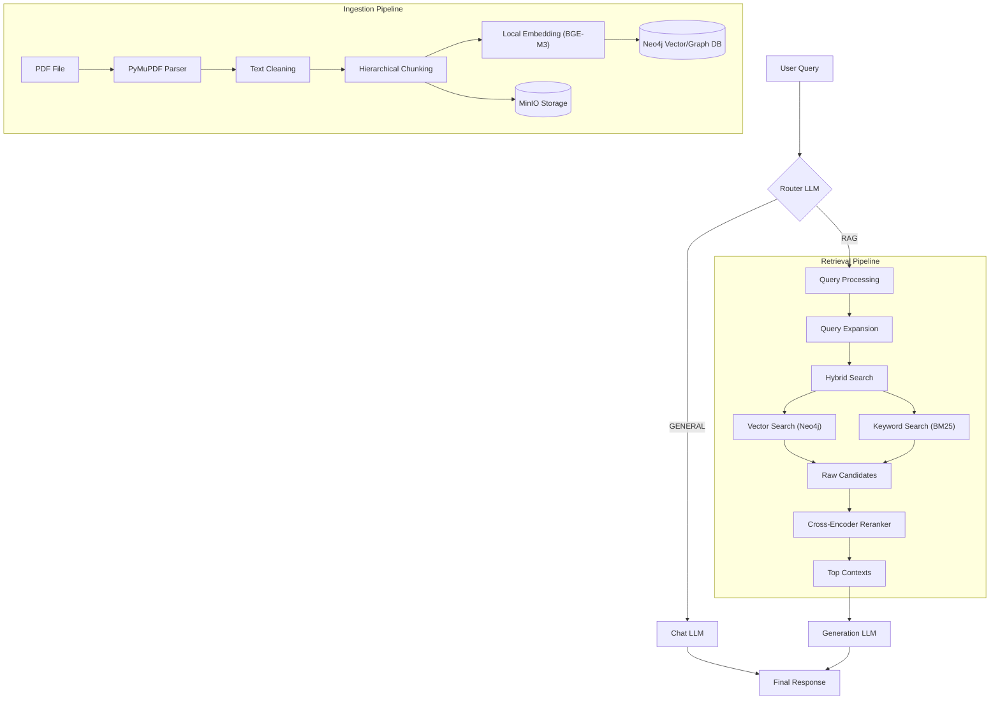

# Detailed System Architecture & Functionality Guide

This document provides an in-depth look at the internal workings of the Chat A.I+ RAG system.

## 1. System Architecture

The system follows a modular Retrieval-Augmented Generation (RAG) architecture, designed for high precision and scalability.



## 2. Core Components

### 2.1. Ingestion Pipeline (`backend/app/services/pdf_ingest.py` & `chucking/`)

The ingestion process transforms raw PDF documents into searchable, structured data.

1.  **Parsing**: Uses `PyMuPDF` (fitz) to extract text and page metadata.
2.  **Cleaning**:
    *   Fixes hyphenated line breaks (e.g., "process-\n ing" -> "processing").
    *   Normalizes whitespace and handles layout artifacts.
3.  **Hierarchical Chunking** (`hierarchical_chunker.py`):
    *   **Strategy**: Parent-Child Chunking.
    *   **Level 1 (Parent/Coarse)**: Large chunks (~1024 tokens) that capture broader context. Used for providing context to the LLM.
    *   **Level 2 (Child/Fine)**: Small chunks (sentences) derived from parents. Used for precise vector search matching.
    *   **Metadata**: Each chunk retains `page_number`, `source_file`, and `parent_id` for traceability.

### 2.2. Storage Layer

*   **Neo4j (Graph & Vector DB)**:
    *   Stores chunks as Nodes (`:Chunk`).
    *   Stores relationships (`:HAS_PARENT`, `:HAS_MESSAGE`).
    *   **Vector Index**: Stores 1024-dim embeddings from `BAAI/bge-m3` for cosine similarity search.
    *   **Chat History**: Stores session data as a graph (`Session` -> `Message`).
*   **MinIO (Object Storage)**:
    *   Stores the original raw PDF files for retrieval and UI preview.

### 2.3. Intelligent Routing (`backend/app/services/router.py`)

A specialized "Gatekeeper" LLM (using SambaNova/DeepSeek) analyzes every incoming user query to decide the best path:

*   **RAG Mode**: For queries requiring factual grounding, specific document retrieval, or analysis (e.g., "What does the contract say about termination?", "Summarize the report").
*   **GENERAL Mode**: For chit-chat, creative writing, coding tasks, or general knowledge (e.g., "Hello", "Write a Python script", "1+1=?").

### 2.4. Retrieval Pipeline (`backend/app/services/rag_pipeline.py`)

When in **RAG Mode**, the system executes a sophisticated retrieval strategy:

1.  **Query Processing**:
    *   **Expansion**: The system generates multiple variations of the user's query using an LLM to increase the chance of matching relevant terms (e.g., "contract termination" -> "agreement end clauses", "firing conditions").
2.  **Hybrid Search**:
    *   **Vector Search (Semantic)**: Finds chunks with similar meaning using embeddings stored in Neo4j.
    *   **Keyword Search (Lexical)**: Uses **BM25** (Best Match 25) to find exact keyword matches, crucial for specific names, dates, or technical terms that embeddings might miss.
3.  **Reranking** (`rerank.py`):
    *   Top results from both searches are combined.
    *   A Cross-Encoder model (`BAAI/bge-reranker-v2-m3`) re-scores every candidate pair (Query, Document) to filter out "hallucinated" matches and order them by true relevance.

### 2.5. Generation

*   **LLM**: Uses **Groq** (Llama 3 70B) for high-speed, high-quality generation.
*   **Context Injection**: The top reranked chunks are formatted and injected into the system prompt, ensuring the LLM answers strictly based on the retrieved evidence.

## 3. Key Modules & Functions

| Module | Key Function | Description |
| :--- | :--- | :--- |
| `pdf_ingest.py` | `extract_pages` | Reads PDF bytes and returns a list of pages with text. |
| `hierarchical_chunker.py` | `chunk_hierarchical` | Implements the 2-level chunking logic (Parent/Child). |
| `embedding.py` | `LocalEmbedder.encode` | Generates embeddings using `BAAI/bge-m3` with L2 normalization. |
| `rerank.py` | `LocalReranker.rerank` | Re-scores a list of [Query, Passage] pairs using a Cross-Encoder. |
| `rag_pipeline.py` | `run` | Orchestrates Query Expansion -> Hybrid Search -> Reranking. |
| `router.py` | `route_query` | Classifies user intent (RAG vs GENERAL) to save resources. |
| `neo4j_store.py` | `search` | Executes the vector search query against the Neo4j index. |

## 4. UI & Frontend

The frontend is a vanilla JS application (using ES Modules) served by FastAPI.
*   **Chat Interface**: Real-time chat with streaming responses.
*   **Document Sidebar**: Lists ingested files from MinIO.
*   **PDF Preview**: Embedded viewer fetching directly from MinIO stream.

```
